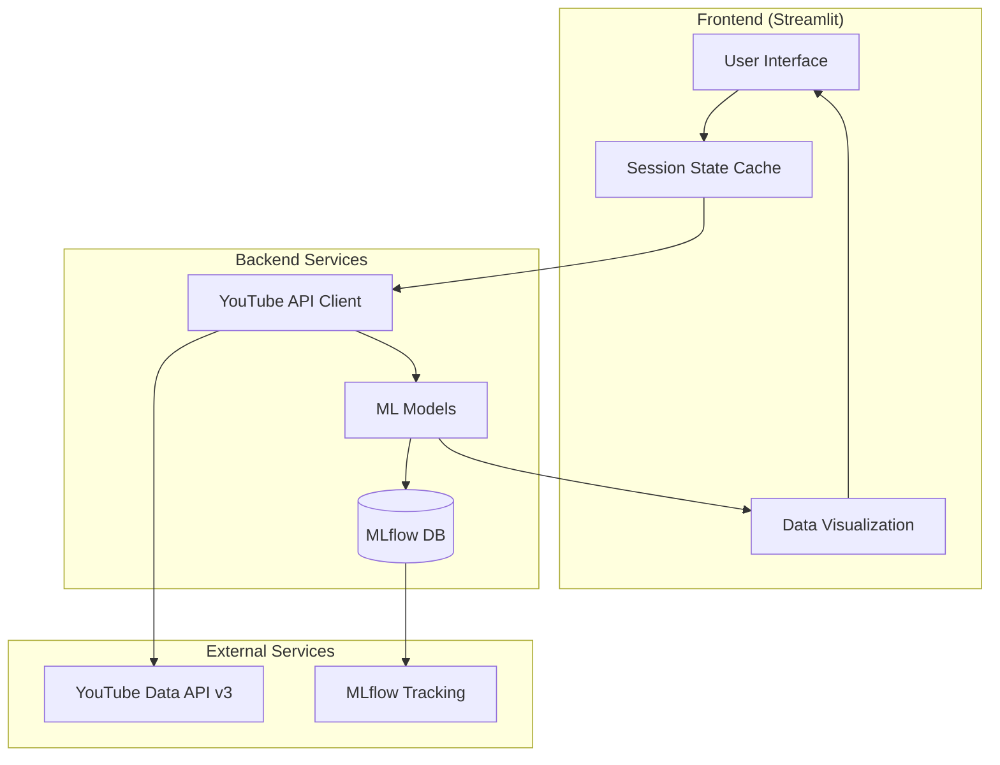
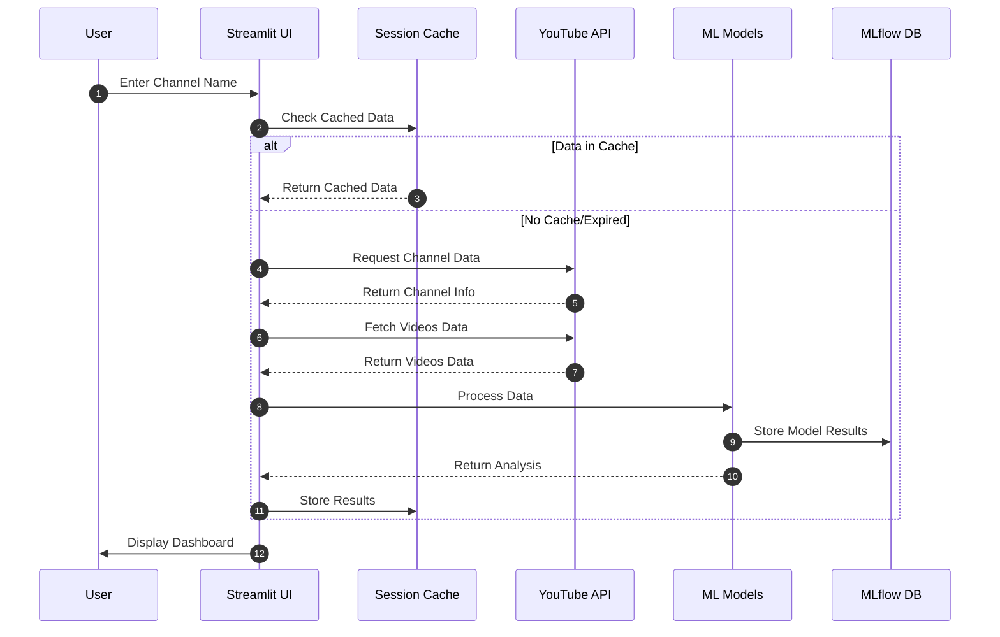
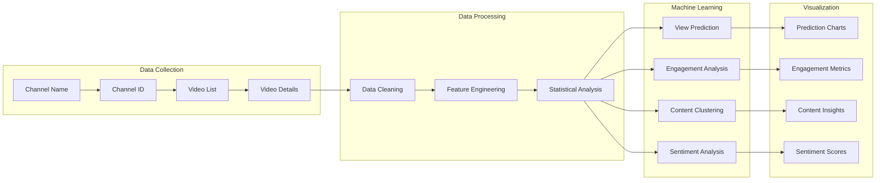
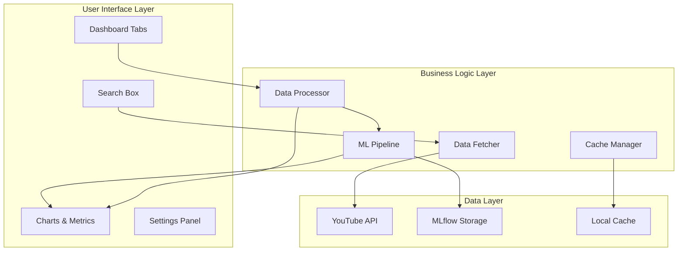
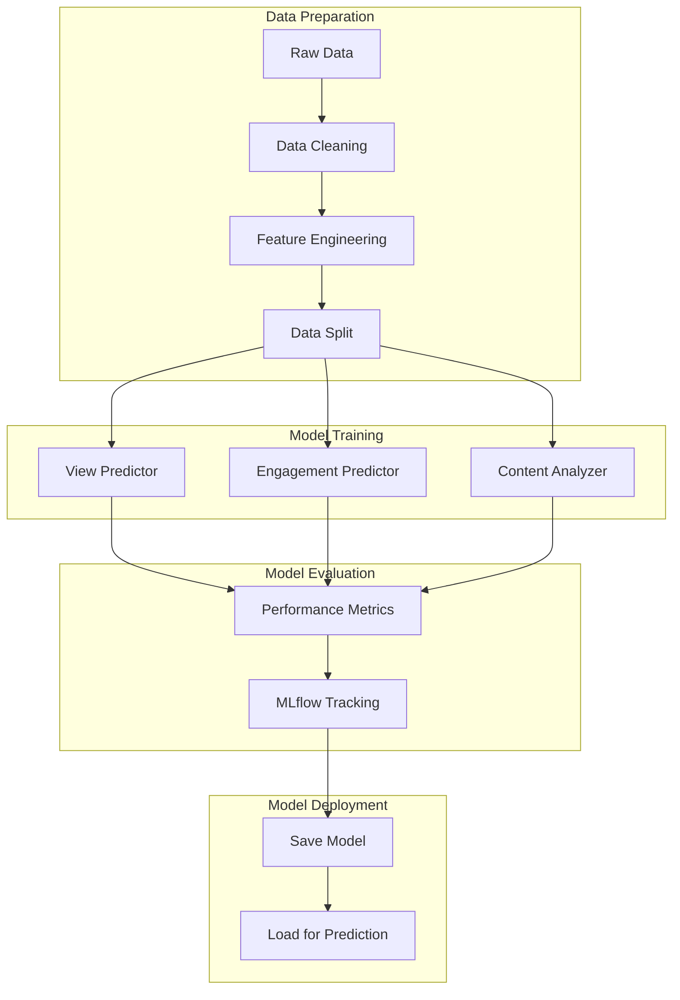
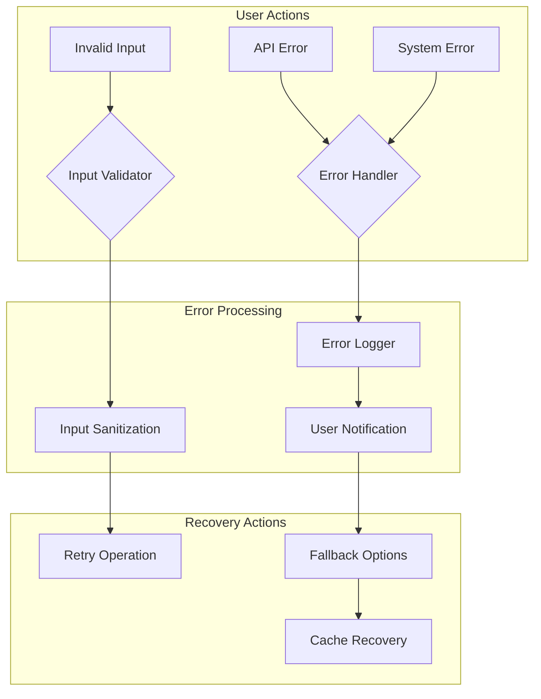
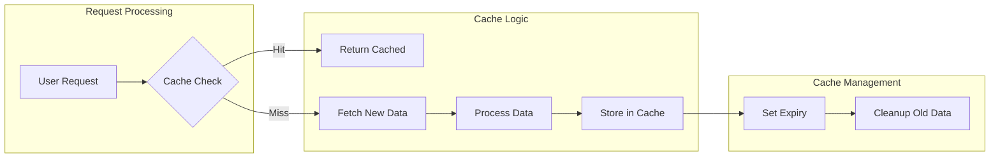
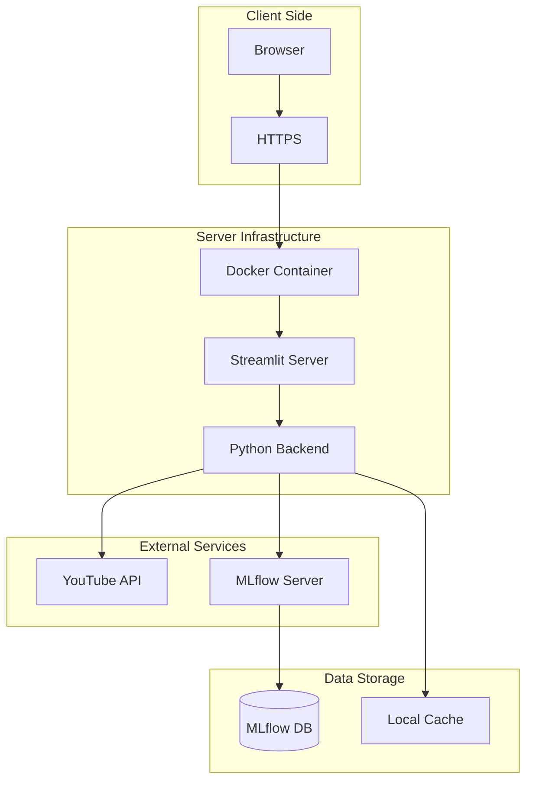

# YouTube Analytics Dashboard - Process Documentation

## System Architecture

## Data Flow Process

## Analysis Pipeline

## Component Interaction

## Model Training Process

## Error Handling Flow

## Caching Strategy

## Deployment Architecture

## Key Process Notes

1. **Data Collection Process**
   - Channel name input triggers API search
   - Channel ID retrieved for detailed data
   - Video list fetched in batches
   - Details collected for analysis

2. **Analysis Pipeline**
   - Data cleaning and normalization
   - Feature engineering for ML models
   - Multiple analysis tracks run parallel
   - Results cached for performance

3. **Caching Strategy**
   - Session-based caching
   - One-hour expiry for API data
   - Persistent storage for ML models
   - Cache invalidation on updates

4. **Error Handling**
   - Input validation at entry
   - API error recovery
   - Graceful degradation
   - User feedback system

5. **Performance Optimization**
   - Batch processing for API calls
   - Parallel model execution
   - Efficient data structures
   - Resource monitoring

6. **Security Measures**
   - API key protection
   - Data sanitization
   - Access control
   - Secure storage

## Implementation Considerations

1. **Scalability**
   - Horizontal scaling capability
   - Load balancing ready
   - Distributed processing support
   - Cache sharing between instances

2. **Maintenance**
   - Regular cache cleanup
   - Log rotation
   - Model retraining
   - Performance monitoring

3. **Updates**
   - Rolling updates support
   - Zero-downtime deployment
   - Version control
   - Backward compatibility

4. **Monitoring**
   - Performance metrics
   - Error tracking
   - Usage statistics
   - Resource utilization 